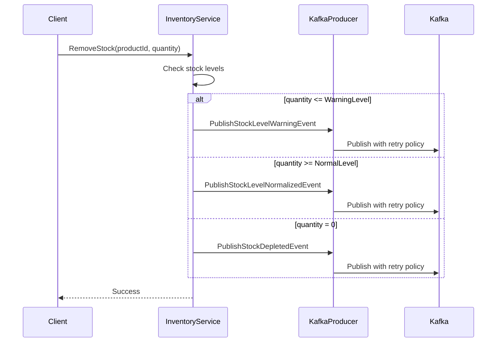
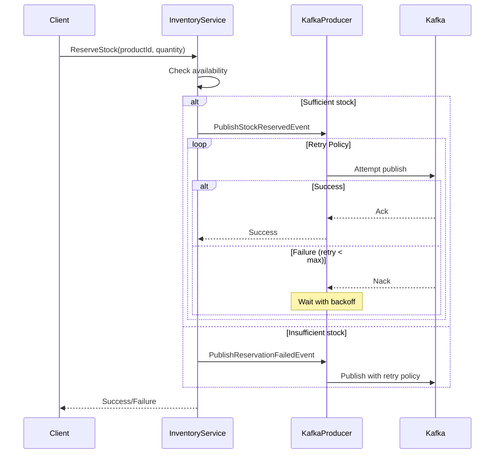

# Inventory Service Events and Settings Documentation

## Integration Events

The Inventory Service publishes several integration events to notify other services about important changes in inventory status. These events are published to Kafka and can be consumed by any interested service.

### Stock Level Events

#### StockLevelWarningIntegrationEvent
Triggered when an item's available quantity falls below the configured warning threshold.
```json
{
    "productId": "string",
    "productName": "string",
    "currentQuantity": "integer",
    "warningThreshold": "integer"
}
```

#### StockLevelNormalizedIntegrationEvent
Triggered when an item's available quantity returns to or exceeds the normal level threshold.
```json
{
    "productId": "string",
    "productName": "string",
    "currentQuantity": "integer",
    "normalThreshold": "integer",
    "normalizedAt": "datetime (UTC)"
}
```

#### StockDepletedIntegrationEvent
Triggered when an item's available quantity reaches zero.
```json
{
    "productId": "string",
    "productName": "string",
    "reservedQuantity": "integer",
    "depletedAt": "datetime (UTC)",
    "hasPendingReservations": "boolean"
}
```

### Reservation Events

#### StockReservedIntegrationEvent
Triggered when stock is successfully reserved for an order.
```json
{
    "orderId": "guid",
    "productId": "string",
    "quantity": "integer",
    "unitPrice": "decimal"
}
```

#### ReservationFailedIntegrationEvent
Triggered when a stock reservation request cannot be fulfilled.
```json
{
    "orderId": "guid",
    "failedItems": [
        {
            "productId": "string",
            "productName": "string",
            "requestedQuantity": "integer",
            "availableQuantity": "integer"
        }
    ],
    "reason": "string"
}
```

## Configuration Settings

### Stock Thresholds (`StockThresholds`)

Configuration for various inventory level thresholds and auto-reorder settings.

| Setting | Type | Default | Description |
|---------|------|---------|-------------|
| `WarningLevel` | int | 10 | Quantity threshold that triggers stock warning events |
| `CriticalLevel` | int | 5 | Quantity threshold for critical stock levels |
| `NormalLevel` | int | 20 | Quantity threshold for normal stock levels |
| `EnableAutoReorder` | bool | true | Whether to enable automatic reordering |
| `ReorderPoint` | int | 15 | Quantity threshold that triggers auto-reorder |
| `ReorderQuantity` | int | 50 | Default quantity to reorder when auto-reorder is triggered |

### Event Settings (`EventSettings`)

Configuration for event publishing behavior and retry policies.

| Setting | Type | Default | Description |
|---------|------|---------|-------------|
| `PublishStockWarnings` | bool | true | Enable/disable stock warning events |
| `PublishStockNormalized` | bool | true | Enable/disable stock normalized events |
| `PublishStockDepleted` | bool | true | Enable/disable stock depleted events |
| `EventRetryCount` | int | 3 | Maximum number of retries for failed event publishing |
| `EventRetryDelayMs` | int | 1000 | Initial delay between retries in milliseconds |
| `EventRetryBackoffMultiplier` | double | 2.0 | Multiplier for increasing delay between retries |

## Example Configuration

```json
{
  "InventorySettings": {
    "Thresholds": {
      "WarningLevel": 10,
      "CriticalLevel": 5,
      "NormalLevel": 20,
      "EnableAutoReorder": true,
      "ReorderPoint": 15,
      "ReorderQuantity": 50
    },
    "Events": {
      "PublishStockWarnings": true,
      "PublishStockNormalized": true,
      "PublishStockDepleted": true,
      "EventRetryCount": 3,
      "EventRetryDelayMs": 1000,
      "EventRetryBackoffMultiplier": 2.0
    }
  }
}
```

## Event Publishing Flow

1. Events are published through the `KafkaProducerService`
2. Each event type can be enabled/disabled through configuration
3. Failed event publishing attempts are retried according to the retry policy:
   - Initial retry delay: 1000ms
   - Each subsequent retry increases the delay by the backoff multiplier
   - Maximum number of retries is configurable
4. All events include:
   - Event type in the message headers
   - Product ID as the message key (except for reservation events which use Order ID)
   - Timestamp in UTC
   - Relevant thresholds and quantities

## Monitoring and Troubleshooting

- All event publishing attempts are logged with the event type, key, and status
- Failed attempts are logged with the retry count and next retry delay
- Successful retries are logged with the total retry count
- Auto-reorder triggers are logged with the current quantity and reorder quantity
- All timestamps in events are in UTC format

## Usage Examples

### 1. Stock Level Management

```csharp
// Configure inventory settings
var settings = new InventorySettings
{
    Thresholds = new StockThresholds
    {
        WarningLevel = 10,
        NormalLevel = 20,
        EnableAutoReorder = true,
        ReorderPoint = 15
    }
};

// Create a new inventory item
await inventoryService.CreateInventoryItemAsync(
    productId: "PROD-001",
    name: "Example Product",
    quantity: 25,
    unitPrice: 19.99m,
    sku: "EX-001"
);
// No events published (quantity > NormalLevel)

// Remove stock
await inventoryService.RemoveStockAsync("PROD-001", 10);
// No events published (quantity = 15, WarningLevel < quantity < NormalLevel)

await inventoryService.RemoveStockAsync("PROD-001", 6);
// Publishes StockLevelWarningIntegrationEvent (quantity = 9 < WarningLevel)

await inventoryService.AddStockAsync("PROD-001", 15);
// Publishes StockLevelNormalizedIntegrationEvent (quantity = 24 > NormalLevel)
```

### 2. Stock Reservation Flow

```csharp
// Attempt to reserve stock
var success = await inventoryService.ReserveStockAsync("PROD-001", 5);
if (success)
{
    // Publishes StockReservedIntegrationEvent
    // If remaining quantity <= WarningLevel, also publishes StockLevelWarningIntegrationEvent
}
else
{
    // Publishes ReservationFailedIntegrationEvent
}

// Confirm the reservation
await inventoryService.ConfirmReservationAsync("PROD-001", 5);
// If quantity = 0, publishes StockDepletedIntegrationEvent
```

## Sequence Diagrams

### Stock Level Events Flow



### Reservation Flow with Retry



## Common Scenarios and Event Sequences

1. **Normal Stock Management**
   - Add stock → No events if within normal range
   - Remove stock → Warning event when crossing threshold
   - Add stock → Normalized event when returning to normal level

2. **Reservation Lifecycle**
   - Reserve → StockReservedIntegrationEvent
   - Confirm → Possible StockDepletedIntegrationEvent
   - Cancel → Possible StockLevelNormalizedIntegrationEvent

3. **Auto-reorder Flow**
   - Stock falls below ReorderPoint
   - System logs reorder trigger
   - (Future enhancement: Publish reorder event)

4. **Error Handling**
   - Failed publish → Retry with exponential backoff
   - Max retries reached → Log error
   - Successful retry → Log success with attempt count

## Best Practices

1. **Event Handling**
   - Always handle events idempotently
   - Use event timestamps for ordering
   - Validate event data before processing

2. **Configuration**
   - Set appropriate thresholds based on business needs
   - Configure retry policies based on network reliability
   - Enable auto-reorder only if automated purchasing is supported

3. **Monitoring**
   - Monitor failed event publications
   - Track stock levels against thresholds
   - Set up alerts for repeated retry attempts

4. **Performance**
   - Use appropriate Kafka partitioning (by ProductId)
   - Configure reasonable retry delays
   - Monitor event processing latency 