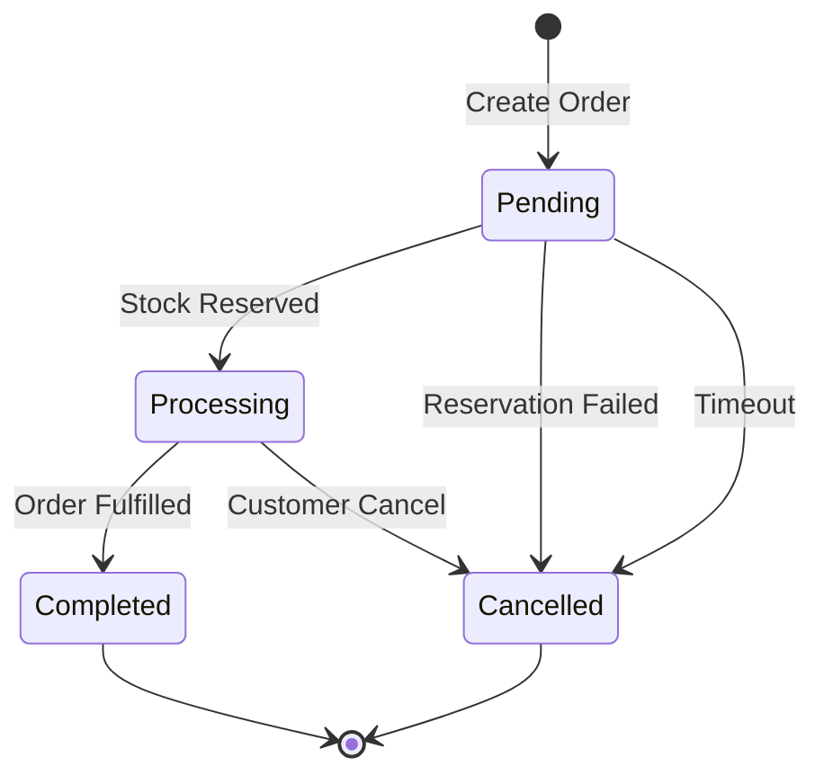
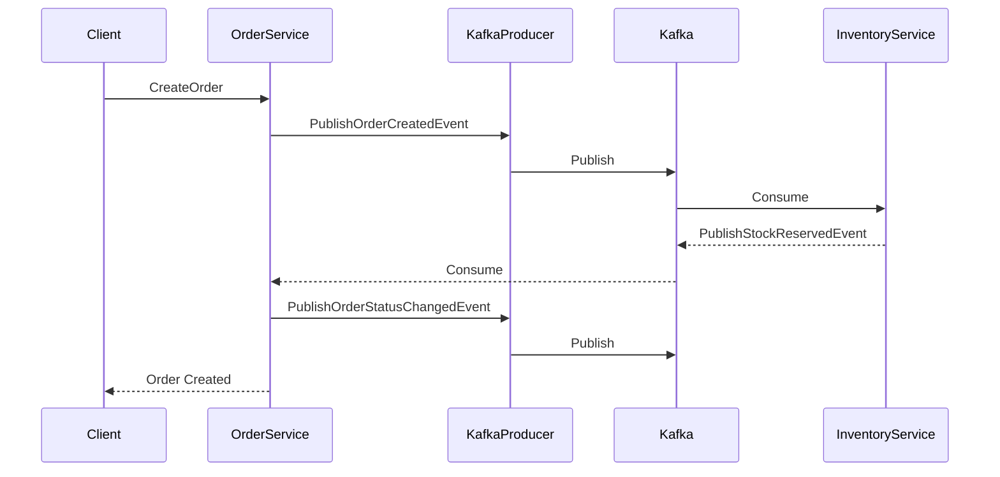

# Order Service Documentation

## Overview

The Order Service is responsible for managing orders in the e-commerce system. It integrates with Kafka for event-driven communication with other services, particularly the Inventory Service for stock management.

## Integration Events

### Published Events

#### OrderCreatedIntegrationEvent
Triggered when a new order is created.
```json
{
    "orderId": "guid",
    "customerId": "string",
    "orderDate": "datetime (UTC)",
    "items": [
        {
            "productId": "string",
            "quantity": "integer",
            "unitPrice": "decimal"
        }
    ],
    "totalAmount": "decimal"
}
```

#### OrderStatusChangedIntegrationEvent
Triggered when an order's status changes (e.g., Pending → Processing → Completed).
```json
{
    "orderId": "guid",
    "previousStatus": "string",
    "currentStatus": "string",
    "timestamp": "datetime (UTC)",
    "reason": "string (optional)"
}
```

#### OrderCancelledIntegrationEvent
Triggered when an order is cancelled.
```json
{
    "orderId": "guid",
    "cancellationReason": "string",
    "cancelledAt": "datetime (UTC)",
    "items": [
        {
            "productId": "string",
            "quantity": "integer"
        }
    ]
}
```

### Consumed Events

#### StockReservedIntegrationEvent
Received when stock has been successfully reserved for an order.
```json
{
    "orderId": "guid",
    "productId": "string",
    "quantity": "integer",
    "unitPrice": "decimal"
}
```

#### ReservationFailedIntegrationEvent
Received when stock reservation fails.
```json
{
    "orderId": "guid",
    "failedItems": [
        {
            "productId": "string",
            "productName": "string",
            "requestedQuantity": "integer",
            "availableQuantity": "integer"
        }
    ],
    "reason": "string"
}
```

## Configuration Settings

### Order Settings (`OrderSettings`)

| Setting | Type | Default | Description |
|---------|------|---------|-------------|
| `MaxOrderItems` | int | 50 | Maximum number of items allowed in a single order |
| `MinOrderAmount` | decimal | 0.01 | Minimum total amount for an order |
| `AutoCancelTimeoutMinutes` | int | 15 | Time before pending orders are auto-cancelled |
| `EnableOrderTracking` | bool | true | Enable detailed order status tracking |

### Kafka Settings (`KafkaSettings`)

| Setting | Type | Default | Description |
|---------|------|---------|-------------|
| `BootstrapServers` | string | "localhost:9092" | Kafka broker addresses |
| `OrdersTopic` | string | "orders" | Topic for order-related events |
| `ConsumerGroup` | string | "order-service" | Consumer group ID |
| `EnableAutoCommit` | bool | false | Whether to auto-commit offsets |
| `AutoCommitIntervalMs` | int | 5000 | Auto-commit interval if enabled |

## Example Configuration

```json
{
  "OrderSettings": {
    "MaxOrderItems": 50,
    "MinOrderAmount": 0.01,
    "AutoCancelTimeoutMinutes": 15,
    "EnableOrderTracking": true
  },
  "KafkaSettings": {
    "BootstrapServers": "localhost:9092",
    "OrdersTopic": "orders",
    "ConsumerGroup": "order-service",
    "EnableAutoCommit": false,
    "AutoCommitIntervalMs": 5000
  }
}
```

## Order Status Flow



## Usage Examples

### 1. Creating a New Order

```csharp
// Create a new order
var order = await orderService.CreateOrderAsync(new CreateOrderRequest
{
    CustomerId = "CUST-001",
    Items = new List<OrderItem>
    {
        new() { ProductId = "PROD-001", Quantity = 2 },
        new() { ProductId = "PROD-002", Quantity = 1 }
    }
});
// Publishes OrderCreatedIntegrationEvent

// Order status is updated based on stock reservation result
await orderService.HandleStockReservationResultAsync(
    orderId: order.Id,
    success: true);
// Publishes OrderStatusChangedIntegrationEvent
```

### 2. Cancelling an Order

```csharp
await orderService.CancelOrderAsync(
    orderId: "ORDER-001",
    reason: "Customer requested cancellation");
// Publishes OrderCancelledIntegrationEvent
// Publishes OrderStatusChangedIntegrationEvent
```

## Event Processing Flow



## Best Practices

1. **Order Management**
   - Validate order items before creation
   - Implement idempotent order processing
   - Handle partial order fulfillment
   - Maintain order history

2. **Event Handling**
   - Process events in order
   - Handle duplicate events gracefully
   - Maintain event correlation
   - Log event processing status

3. **Error Handling**
   - Implement circuit breakers for external services
   - Handle timeout scenarios
   - Provide clear error messages
   - Maintain audit logs

4. **Performance**
   - Use appropriate indexes on Order tables
   - Implement caching for frequently accessed data
   - Monitor order processing times
   - Set up alerts for processing delays

## Monitoring

1. **Metrics to Track**
   - Order creation rate
   - Order fulfillment time
   - Cancellation rate
   - Event processing latency
   - Failed event publications

2. **Logging**
   - Order status changes
   - Event processing steps
   - Error conditions
   - Performance metrics

3. **Alerts**
   - High order cancellation rate
   - Long processing times
   - Failed event publications
   - System errors

## Troubleshooting

1. **Common Issues**
   - Order stuck in Pending state
   - Failed event publications
   - Duplicate events
   - Inconsistent order status

2. **Resolution Steps**
   - Check event logs
   - Verify Kafka connectivity
   - Review order status history
   - Check for system errors

3. **Prevention**
   - Regular monitoring
   - Proper error handling
   - Circuit breakers
   - Retry policies 