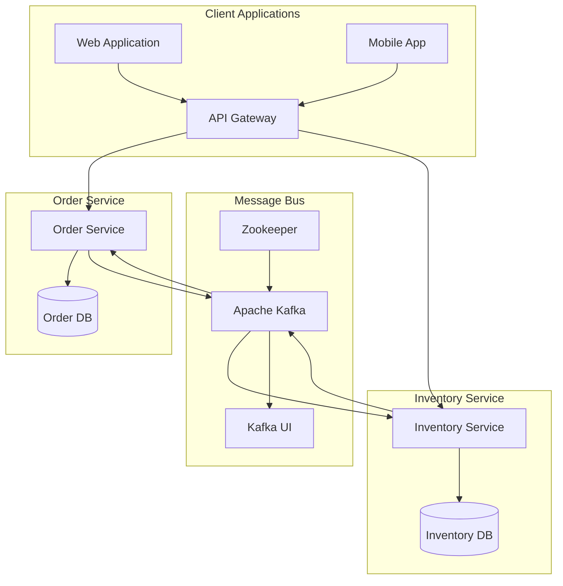
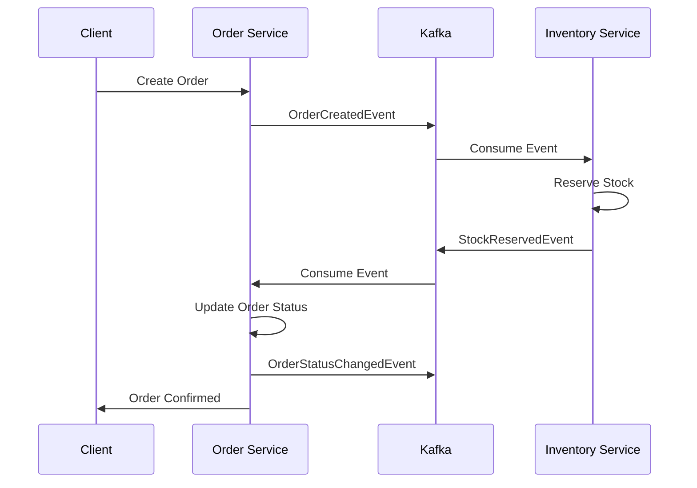
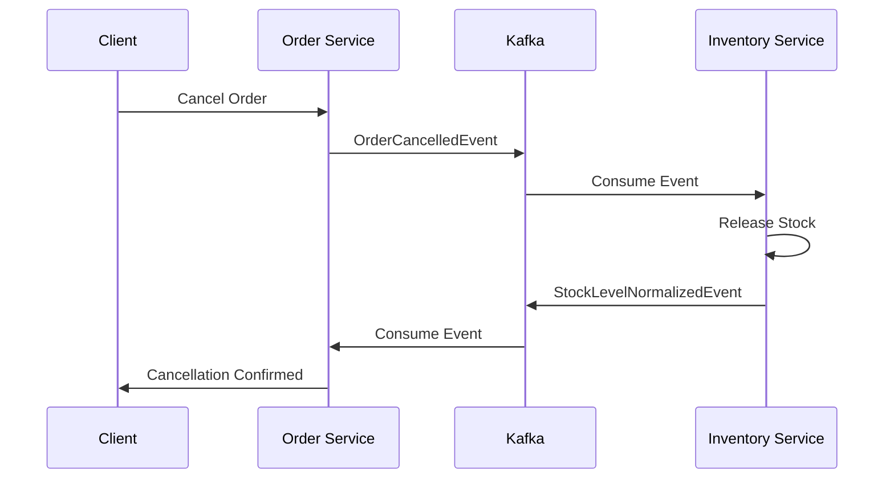

# Microservices Architecture with Kafka

## System Overview

This microservices-based e-commerce system uses Kafka as the messaging backbone for event-driven communication between services. The architecture follows the SAGA pattern for distributed transactions and eventual consistency.

## Architecture Diagram



## Services

### 1. Order Service
- Manages order lifecycle
- Handles order creation, updates, and cancellation
- Publishes order-related events
- Consumes inventory events for stock confirmation

### 2. Inventory Service
- Manages product inventory
- Handles stock reservations and updates
- Publishes inventory-related events
- Consumes order events for stock management

## Event Flow

### Order Creation Flow


### Order Cancellation Flow


## Event Types

### Order Events
- `OrderCreatedIntegrationEvent`
- `OrderStatusChangedIntegrationEvent`
- `OrderCancelledIntegrationEvent`

### Inventory Events
- `StockReservedIntegrationEvent`
- `ReservationFailedIntegrationEvent`
- `StockLevelWarningIntegrationEvent`
- `StockLevelNormalizedIntegrationEvent`
- `StockDepletedIntegrationEvent`

## Infrastructure

### Apache Kafka
- Message broker for event-driven communication
- Ensures reliable message delivery
- Provides message persistence
- Enables event replay and recovery

### Zookeeper
- Manages Kafka cluster
- Handles broker coordination
- Maintains configuration

### Kafka UI
- Monitoring and management interface
- View topics and messages
- Monitor consumer groups
- Track message flow

## Configuration

### Development Environment
```json
{
  "KafkaSettings": {
    "BootstrapServers": "localhost:9092",
    "EnableAutoCommit": false,
    "AutoCommitIntervalMs": 5000
  }
}
```

### Production Environment
```json
{
  "KafkaSettings": {
    "BootstrapServers": "kafka-1:9092,kafka-2:9092,kafka-3:9092",
    "EnableAutoCommit": false,
    "AutoCommitIntervalMs": 5000,
    "SecurityProtocol": "SASL_SSL",
    "SaslMechanism": "PLAIN"
  }
}
```

## Deployment

### Docker Compose
```yaml
version: '3.8'
services:
  zookeeper:
    image: confluentinc/cp-zookeeper:latest
    environment:
      ZOOKEEPER_CLIENT_PORT: 2181
      
  kafka:
    image: confluentinc/cp-kafka:latest
    depends_on:
      - zookeeper
    environment:
      KAFKA_BROKER_ID: 1
      KAFKA_ZOOKEEPER_CONNECT: zookeeper:2181
      KAFKA_ADVERTISED_LISTENERS: PLAINTEXT://kafka:9092
      
  kafka-ui:
    image: provectuslabs/kafka-ui:latest
    depends_on:
      - kafka
    ports:
      - "8080:8080"
    environment:
      KAFKA_CLUSTERS_0_NAME: local
      KAFKA_CLUSTERS_0_BOOTSTRAPSERVERS: kafka:9092
```

## Best Practices

### 1. Event Design
- Use clear, descriptive event names
- Include necessary context in events
- Version events for backward compatibility
- Keep events focused and cohesive

### 2. Message Processing
- Implement idempotent consumers
- Handle out-of-order messages
- Implement dead letter queues
- Monitor consumer lag

### 3. Error Handling
- Implement retry policies
- Use circuit breakers
- Log failed events
- Handle partial failures

### 4. Monitoring
- Track message processing rates
- Monitor consumer group health
- Alert on processing delays
- Track error rates

## Scaling

### 1. Kafka Scaling
- Add brokers to Kafka cluster
- Adjust partition count for topics
- Configure replication factor
- Monitor resource usage

### 2. Service Scaling
- Deploy multiple service instances
- Use consumer groups for load balancing
- Scale based on message lag
- Monitor processing times

## Troubleshooting

### Common Issues
1. Message Processing Delays
   - Check consumer lag
   - Verify resource allocation
   - Review processing logic

2. Event Publishing Failures
   - Check Kafka connectivity
   - Verify broker health
   - Review retry policies

3. Data Inconsistency
   - Review event ordering
   - Check for missed events
   - Verify event processing

### Resolution Steps
1. Check service logs
2. Monitor Kafka UI
3. Verify network connectivity
4. Review configuration
5. Check resource utilization 